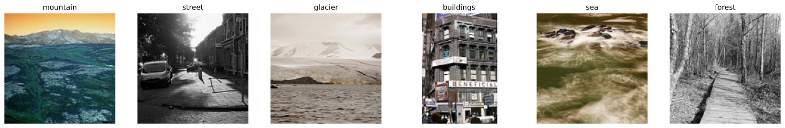
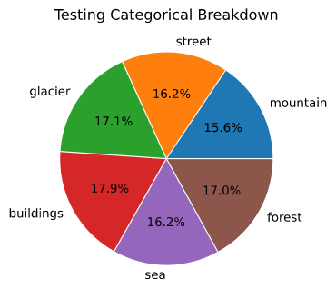
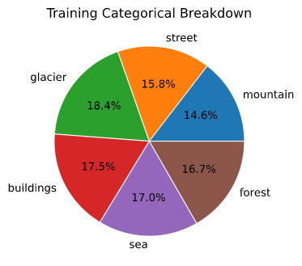
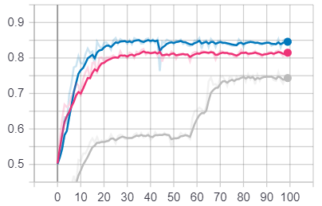
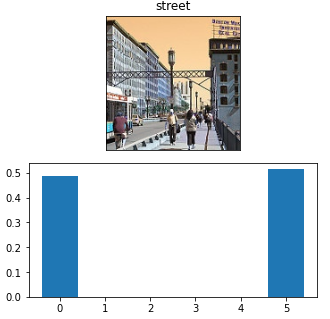

# <a name="top">cNN Image Classification</a>

This project used Python and TensorFlow to explore convolutional neural nets.A Powerpoint was used as an endpoint presentation, in which I discussed how I explored the data, built and trained series of models, and analyze the results. The purpose was to gain a better understanding of the leavers used to control models in TF useing Keas, and the best model recorded achieved an accuracy of %84. A number of prediction samples are looked at, and the errors discussed.  
______________________________________________

## Links
- [Intel Image Dataset](https://www.kaggle.com/puneet6060/intel-image-classification)
Kaggle project hosting the dataset
- [cNN Presentation](https://docs.google.com/presentation/d/15pTsUTayuuk3Yjr66WRyAtrebqUAKJjbbTBJont3CSU/edit?usp=sharing)
A Google Doc hosting my original presentation
______________________________________________

## ToDo

[X] README
[ ] Streamlit app
[ ] YouTube walk through

___________________________________________

## Data

The [Intel Image Dataset](https://www.kaggle.com/puneet6060/intel-image-classification) consists labeled photos of scenery. 


- 'buildings' -> 0 
- 'forest' -> 1,
- 'glacier' -> 2,
- 'mountain' -> 3,
- 'sea' -> 4,
- 'street' -> 5 

The data was originally provided by Intel for data science competitions, and was found on an open Kaggle project. The categories are relatively evenly distributed, and the set includes training, testing, and unlabeled images. Samples were resized and normalized before training. 

- 14,034 Training Image
- 3000 Testing Images
- 7000 Non-labeled Images





______________________________________________


## Training, Models, and Predictions

A variety of models were built in order to experiment with complexity in their depth and layers. Parameters ranged from under 1mil to more than 34 million. Most models arrived at a similar accuracy and validation loss, with a mid-sized model achieving %84 and %1.8 respectively. 

```
Epoch 97/100
11227/11227 [==============================] - 9s 786us/sample - loss: 0.1106 - accuracy: 0.9737 - val_loss: 1.3633 - val_accuracy: 0.8318
Epoch 98/100
11227/11227 [==============================] - 9s 783us/sample - loss: 0.0795 - accuracy: 0.9784 - val_loss: 1.4830 - val_accuracy: 0.8400
Epoch 99/100
11227/11227 [==============================] - 9s 783us/sample - loss: 0.0832 - accuracy: 0.9790 - val_loss: 1.5108 - val_accuracy: 0.8375
Epoch 100/100
11227/11227 [==============================] - 9s 780us/sample - loss: 0.0522 - accuracy: 0.9871 - val_loss: 1.4477 - val_accuracy: 0.8432
```


After the model was training, we took a look at some predictions. It can be informative observe miss-categorization due to confounding variables such as ambiguous images, extremes angles, or foreign objects. For instance there are common elements shared in a category that throw off the model when they appear in others, such as people often appearing in streets.




The project was meant to be an exercise in building and working with neural nets, and while I would consider it a success, I also learned the value in pretrained models. The time it took to build and train these models would have been much better spent using pretrained weights from a common library such as ResNet.
